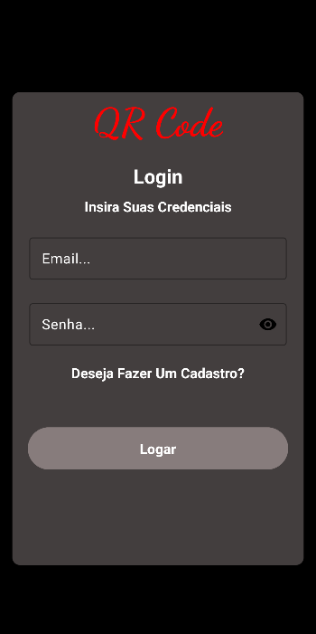
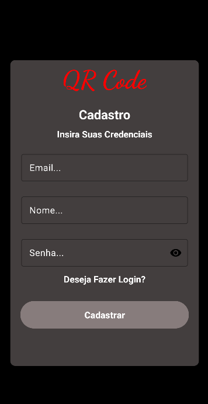
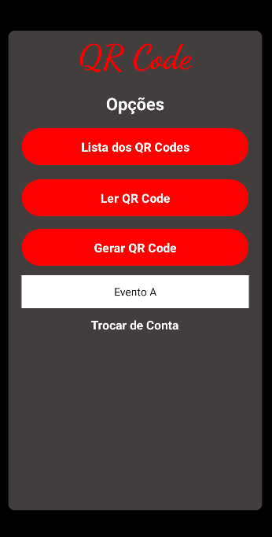
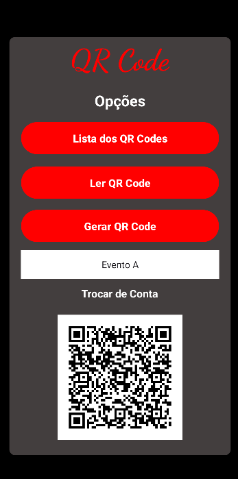
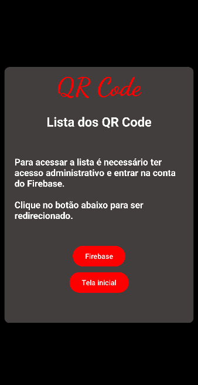

# 🎟️ Leitor Evento

**Um aplicativo Android para geração e leitura de QR Codes para eventos, armazenando as informações no Firebase para que administradores tenham acesso ao horário de chegada e saída do usuário, exibindo as informações associadas.**

[➡️ Baixe o APK no GitHub releases!]

---

## 📝 Sobre o projeto

**Leitor Evento** é um aplicativo desenvolvido para facilitar a gestão de eventos por meio de QR Codes.  
Permite a geração e leitura de códigos, associando os dados dos usuários e armazenando as informações em um banco de dados na nuvem, garantindo o controle e acesso pelos administradores.

---

## 🚀 Funcionalidades principais

✅ Geração de QR Code para eventos  
✅ Leitura de QR Code e exibição das informações associadas  
✅ Armazenamento das informações no **Firebase**  
✅ Acesso a dados pelos administradores para controle de horários de chegada e saída  

---

## 🛠️ Tecnologias utilizadas

  
  
  
  

---

## 🌐 Como acessar

O aplicativo será disponibilizado em formato APK no GitHub releases para instalação manual.  

**Dica**: Permita a instalação de fontes desconhecidas no seu dispositivo para instalar o APK.

---

## 👨‍💻 Equipe de desenvolvimento

- Gustavo Mandu Ferreira Matori  
- Rafael  
- Ryan Dias  

---

## 🎓 Projeto acadêmico

Desenvolvido como atividade da disciplina **Programação para Dispositivos Móveis** na **UNICID**, apresentado como parte da avaliação acadêmica.

---

## 📷 Imagens

 
 

---

## 📄 Licença

Este projeto foi desenvolvido com fins **educacionais** e de **demonstração**.
